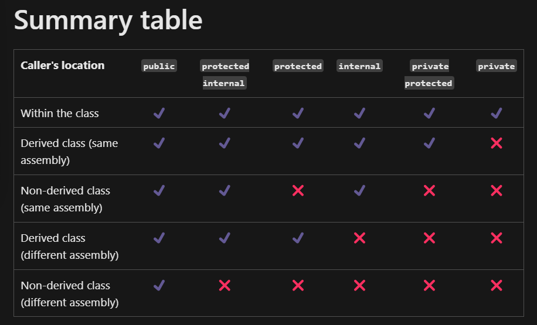

# 03 Object-Oriented Programming

1. What are the six combinations of access modifier keywords and what do they do? 

    They control the accessablity of fields/methods in the class and classes themselves.

    

2. What is the difference between the static, const, and readonly keywords when applied to a type member?

    static: makes it a class variable that not dependent on any instances
    const: makes it not modifiable, implicitly static
    readonly: makes it not modifiable, but can be initiallized during runtime

3. What does a constructor do?

    Instanciate a class.

4. Why is the partial keyword useful?

    When working on large projects, spreading a class over separate files enables multiple programmers to work on it at the same time.

    When working with automatically generated source, code can be added to the class without having to recreate the source file. Visual Studio uses this approach when it creates Windows Forms, Web service wrapper code, and so on. You can create code that uses these classes without having to modify the file created by Visual Studio.

    When using source generators to generate additional functionality in a class.

5. What is a tuple?

    A lightweight data structures that you can use to group loosely related data elements.

6. What does the C# record keyword do?

    It is a compact and easy way to write reference types (immutable) that automatically behave like value type.

7. What does overloading and overriding mean?

    Overloading means two or more methods in one class have the same method name but different signatures.

    Overriding means two methods, one in the base class and one in the derived class, have the same method name and signature.

8. What is the difference between a field and a property?

    A field is a variable of any type that is declared directly in a class.
    A property is a member that provides a flexible mechanism to read, write or compute the value of a private field.

9. How do you make a method parameter optional?

    Assigning default values for that parameter.

10. What is an interface and how is it different from abstract class?

    An interface defines a contract. It includes public abstract methods to be implemented by classes that inherite it. Contrast from abstract class, it can't contain concrete methods or fields, and all methods are public by default.

11. What accessibility level are members of an interface?

    Public.

12. True/False. Polymorphism allows derived classes to provide different implementations of the same method.

    T

13. True/False. The override keyword is used to indicate that a method in a derived class is providing its own implementation of a method.

    T

14. True/False. The new keyword is used to indicate that a method in a derived class is providing its own implementation of a method.

    F

15. True/False. Abstract methods can be used in a normal (non-abstract) class. 

    F

16. True/False. Normal (non-abstract) methods can be used in an abstract class. 

    T

17. True/False. Derived classes can override methods that were virtual in the base class. 

    T

18. True/False. Derived classes can override methods that were abstract in the base class. 

    T

19. True/False. In a derived class, you can override a method that was neither virtual non abstract in the base class.

    F

20. True/False. A class that implements an interface does not have to provide an implementation for all of the members of the interface.

    F

21. True/False. A class that implements an interface is allowed to have other members that aren’t defined in the interface.

    T

22. True/False. A class can have more than one base class.

    F

23. True/False. A class can implement more than one interface.

    T